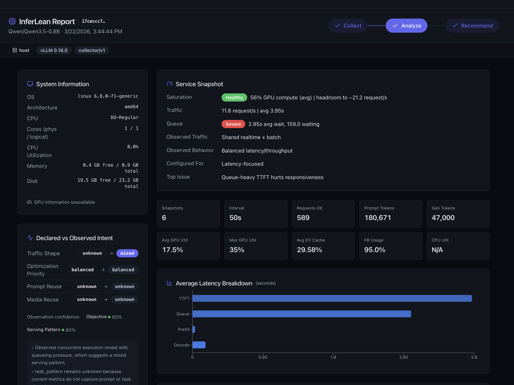
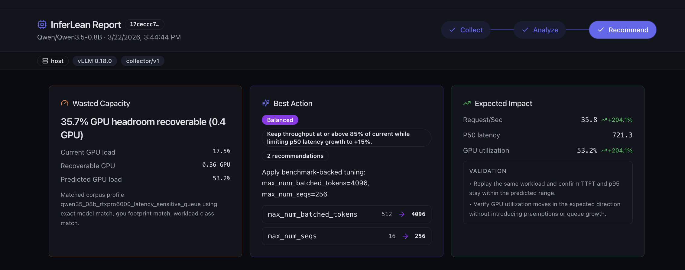

# InferLean

**Find your vLLM bottlenecks, get clear tuning recommendations, and open a dashboard in minutes.**

InferLean is a CLI for inference performance analysis. It collects runtime signals from your serving stack, uploads a job to the InferLean dashboard, and returns a direct link to analysis and recommendations you can act on immediately.

[Website](https://inferlean.com)

## Why InferLean

- **Fast time to value:** install the CLI, run one command, and get a dashboard link in about 3 minutes.
- **Built for real inference systems:** designed around vLLM deployments and the bottlenecks that actually matter.
- **Actionable results:** not just raw metrics, but diagnosis plus recommendation.
- **Smooth workflow:** the CLI collects locally, triggers analysis, waits for completion, and opens the dashboard automatically.

## 3-Minute Quickstart

Install the CLI:

```bash
curl -fsSL https://raw.githubusercontent.com/inferLean/inferlean-project/main/scripts/install_inferlean.sh | sh
```

Run InferLean against your local vLLM setup:

```bash
inferlean run
```

What happens:

1. InferLean collects runtime metrics and profiling data from the machine running vLLM.
2. It uploads the collector report to the InferLean backend.
3. It waits for analysis and recommendation to complete.
4. It prints the top issue, top recommendation, and your dashboard URL.
5. It opens the dashboard in your browser automatically.

By default, the CLI sends jobs to the InferLean hosted dashboard and opens the job page automatically when analysis is ready.

## Example CLI Experience

```text
$ inferlean run --duration-minutes 3
[ok] Collecting runtime metrics...
[ok] Triggering backend job...
Job queued: 4f7c2e1a
[ok] Waiting for analysis and recommendation...
Top issue: Queue pressure is dominating latency while GPU headroom is still available.
Top recommendation: Increase max_num_seqs and raise max_num_batched_tokens to recover throughput without pushing GPU memory into the red.
Current load: 71% GPU util | 23.8 req/s | p95 latency 842 ms
Recoverable capacity: 18-27% more throughput at the current traffic profile
For further details, see dashboard: https://app.inferlean.com/jobs/4f7c2e1a
[ok] Dashboard opened in browser
```

This is the core promise: one command, a real diagnosis, and a dashboard you can share with your team.

## What You See In The Dashboard

### Analyze

The analyze view turns raw collection data into an operator-friendly diagnosis:

- traffic and latency behavior
- queueing and saturation signals
- likely bottleneck classification
- deployment and workload context



### Recommend

The recommend view focuses on what to change next:

- top recommended action
- expected impact
- wasted capacity summary
- recommendation details you can validate and roll back safely



## Who This Is For

- teams running **vLLM** in production or staging
- engineers debugging poor throughput or unstable latency
- operators who want clearer guidance than raw Prometheus charts
- anyone who wants to go from “something is off” to “here’s what to change” quickly

## Open Source CLI, Hosted Results

InferLean is a strong fit for an open-source + hosted workflow:

- install the CLI locally in seconds
- run it where your inference server lives
- get a hosted dashboard link for analysis and recommendations

That makes it easy for users to try InferLean without setting up a full local observability stack first.

## Notes

- `inferlean run` is the easiest starting point.
- The CLI expects a reachable local vLLM deployment for auto-discovery mode.

## Learn More

- [inferlean.com](https://inferlean.com)
- [Project repository](https://github.com/inferLean/inferlean-project)
